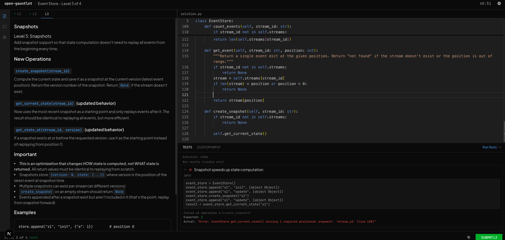

# Open Gauntlet

I spent the last few months applying to companies like Anthropic, Ramp, Coinbase, and Perplexity. Almost every one used the same type of assessment: a CodeSignal or CoderPad problem with four escalating levels, 90 minutes, and test-gated progression. You might know it as a CodeSignal ICF, a progressive OA, or a multi-level assessment. The format is always the same: one problem that evolves across four levels, where bad design decisions at Level 1 compound by Level 3.

Practicing it realistically is genuinely hard. The only public resource I found was a single GitHub repo with one mock problem. So I built Open Gauntlet: a local web app with 6 practice problems in the same format. Pick a problem, start the timer, write your solution in a Monaco editor, submit to run against hidden tests, and unlock the next level. Your attempts save locally so you can track progress across sessions.

I'm taking the liberty of naming this format. ICF is CodeSignal's branding. "Progressive OA" doesn't stick. I'm calling it a Gauntlet: four escalating levels you can't skip, where every mistake at Level 2 catches up to you at Level 4.



## Quick Start

```bash
git clone https://github.com/spartypkp/open-gauntlet
cd open-gauntlet
npm install
npm run dev
```

Open [http://localhost:3000](http://localhost:3000). Requires Node.js 18+ and Python 3.8+.

No Docker, no containers, no account, no cloud. Code runs locally on your machine.

## The Gauntlet Format

One problem. Four levels. Each level extends what you built in the previous one. You can't skip.

| Level | What It Tests |
|-------|--------------|
| **L1** | CRUD. Build the core data structure and basic operations. |
| **L2** | Queries. Filter, aggregate, search across what you built in L1. |
| **L3** | Cross-cutting refactor. A new dimension that forces you to restructure L1/L2 code. |
| **L4** | History, rollback, or advanced constraints using your L3 infrastructure. |


Completing L3 cleanly is usually passing. L4 is differentiation.

The skill being tested is how you design for change under time pressure — not whether you can recall an algorithm. Bad decisions at L1 don't just slow you down. They can make L3 structurally impossible.

**This format shows up in more places than you'd expect.** Async coding screens with automatic test cases (CodeSignal, CoderPad). Live interviews where an engineer watches and advances you manually. I've even seen it at onsite interviews, in person. The mechanics vary: sometimes you have a timer, sometimes not; sometimes tests are automatic, sometimes the interviewer decides. The core structure is the same.

Open Gauntlet models the async OA version — timed, test-gated, hidden tests on submit — because that's the most common and the hardest to replicate on your own.

## Problems

6 problems grounded in confirmed real assessments:

| Problem | Based On | What L3 Introduces |
|---------|----------|-------------------|
| **Cloud File Storage** | Anthropic, Dropbox | Per-user storage quotas that retroactively apply to all files |
| **Banking System** | Ramp, Coinbase | Scheduled payments that fire lazily on the next balance check |
| **In-Memory Database** | Anthropic | TTL expiration: every read/write needs timestamp awareness |
| **Payroll Tracker** | Ramp | Promotions with salary rate changes mid-pay-period |
| **Event Store** | — | Event versioning and schema evolution |
| **Job Queue** | — | Exponential backoff, dead letter queues, visibility timeouts |

Problems with company names are based on candidate reports and public interview descriptions. Problems without are modeled on the same format and difficulty curve.

## How It Works

1. **Pick a problem** from the home page
2. **Start a run** (timer begins, L1 description loads)
3. **Write your solution** in the Monaco editor (same engine as CoderPad and CodeSignal)
4. **Run Code** (Ctrl+Enter) to test against visible test cases
5. **Submit** to validate against all tests (visible + hidden)
6. **Pass all tests** and click NEXT to unlock the next level
7. **Repeat** through L4 or until the timer expires
8. **Review** your results: levels completed, test pass rates, time breakdown

Runs save to `~/.open-gauntlet/runs/` as JSON files. They survive browser crashes and are human-readable — you can review solutions and track improvement across attempts.

## Adding Problems

Each problem is a self-contained directory in `problems/`:

```
problems/my-problem/
  meta.json              # Title, class name, metadata
  problem.md             # Overview description
  starter.py             # Starter code (class skeleton)
  level-1.md             # Level 1 spec
  level-1.test.json      # Level 1 test cases (visible + hidden)
  level-2.md
  level-2.test.json
  level-3.md
  level-3.test.json
  level-4.md
  level-4.test.json
```

Test cases use an operation-array format that mirrors how the real assessments work:

```json
{
  "name": "Transfer between accounts",
  "operations": [
    ["init"],
    ["create_account", "alice", 100],
    ["transfer", "alice", "bob", 50],
    ["get_balance", "alice"]
  ],
  "expected": [null, true, true, 50]
}
```

See `problems/_template/` for the full reference format.

## Tech Stack

- **Next.js 14** + TypeScript + Tailwind CSS
- **Monaco Editor** (same engine as VS Code, CoderPad, CodeSignal)
- **Local execution** via Node.js `child_process` (runs `python3` directly)
- **File-backed persistence** at `~/.open-gauntlet/runs/`

## Contributing

The highest-value contributions are new problems and language support.

**New problems:** If you've done one of these assessments and remember the shape of it, open a PR. See the Adding Problems section above for the format. Problems based on real assessments (even rough reconstructions from memory) are more valuable than original ones.

**Language support:** Right now everything runs Python 3. Support for JavaScript, Go, Java, or other languages would make this useful to a lot more people.

For everything else, open an issue first.

## License

MIT
